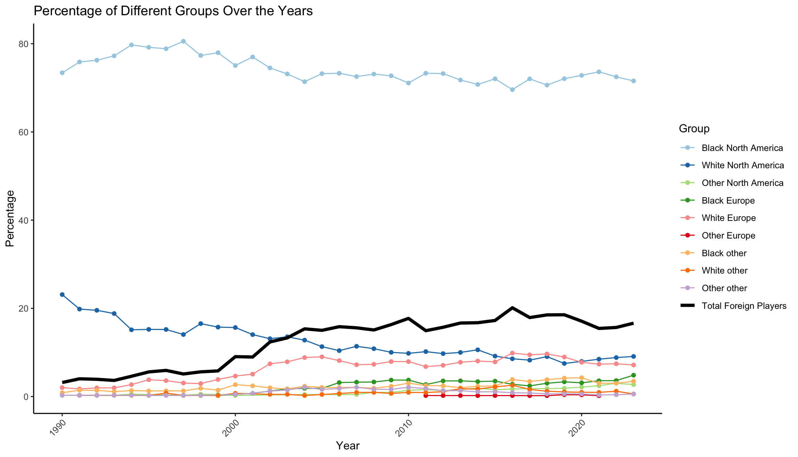
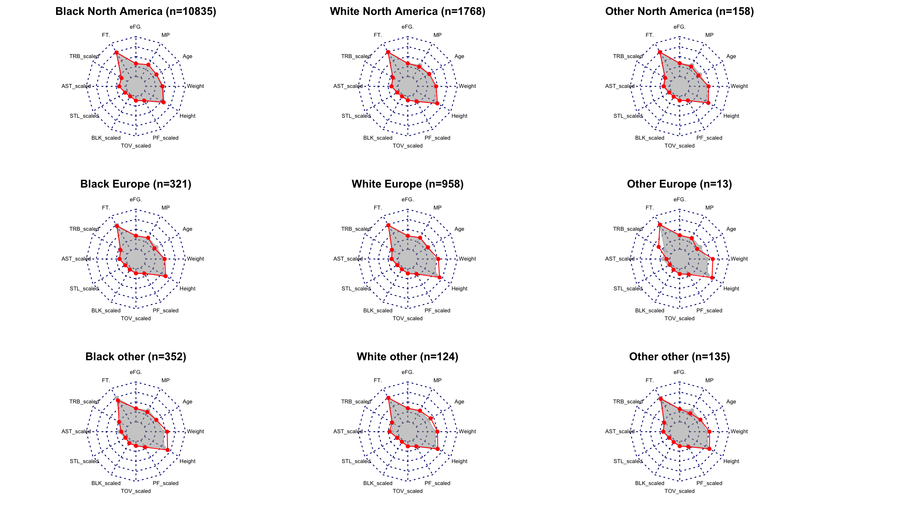

# Existence and Extent of Pay Discrimination Based on Players’ Race and Nationality in NBA: 35 Years of Historical Data

Yiru Wang1, Daniel Sailofsky1

1University of Toronto

**Target Audiences**: academia, coaches, athletes, industry

## Introduction

Pay discrimination based on nationality and ethnicity has been increasing in popularity in physical culture studies and sports economics. Recent studies have yielded mixed findings on this topic.  

## Methods

*Figure 1*

*Figure 2*

In response, we have conducted a comprehensive study utilizing a large, unbalanced panel dataset ranging from 1990 to 2023/4 season with 13,663 observations, to investigate the presence of pay discrimination. We employed a linear mixed-effects model, accounting for players' performance and personal characteristics, and treated players as random effects. Players were categorized by their ethnicity (White, Black, and Other) and geographical region (North America, Europe, and Other), resulting in a nine-level factor variable, including Black North America, White North America, Other North America, etc. The response variable we have here is salary cap adjusted salary. 

*Table 1*

## Results

Descriptive results are shown in Figure 1 and Figure 2. The empirical results from the linear mixed effect model indicate that both White and Black European players receive a statistically significant higher salary compared to Black North American players, with all performance statistics and personal characteristics controlled (more details see in Table 1). A log-likelihood ratio test confirmed the overall significance ($p$ < 0.001) of the demographic group variable, suggesting the existence of salary discrimination among demographic groups. 

## Discussion
 
In conclusion, this study highlights the persistent issue of pay discrimination based on race and nationality within the NBA. The significant salary differences observed underscore the need for continued vigilance and proactive measures to ensure equity in professional sports. By acknowledging and addressing these disparities, the industry can move towards a more inclusive and fair environment for all athletes.

